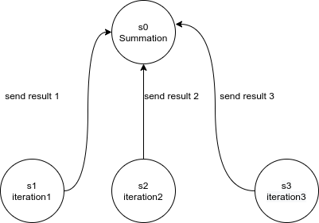
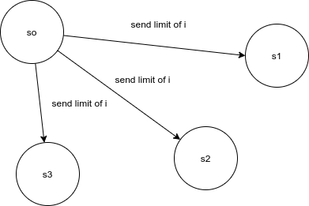
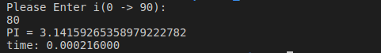
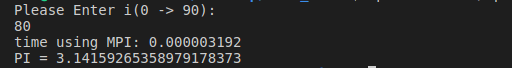

# Run program pi_calc(without mpi)
```
gcc pi_calc.c -lm -o pi
./pi
```
then specifiy limit of i (0->90)


# Run program pi_mpi(with mpi)
```
mpicc -O -o mpi  pi_mpi.c -lm
mpirun -n <number of processes> ./mpi
```
example 
```
mpicc -O -o mpi  pi_mpi.c -lm
mpirun -n 4 ./mpi
```
then specifiy limit of i (0->90)

# Design


# results





